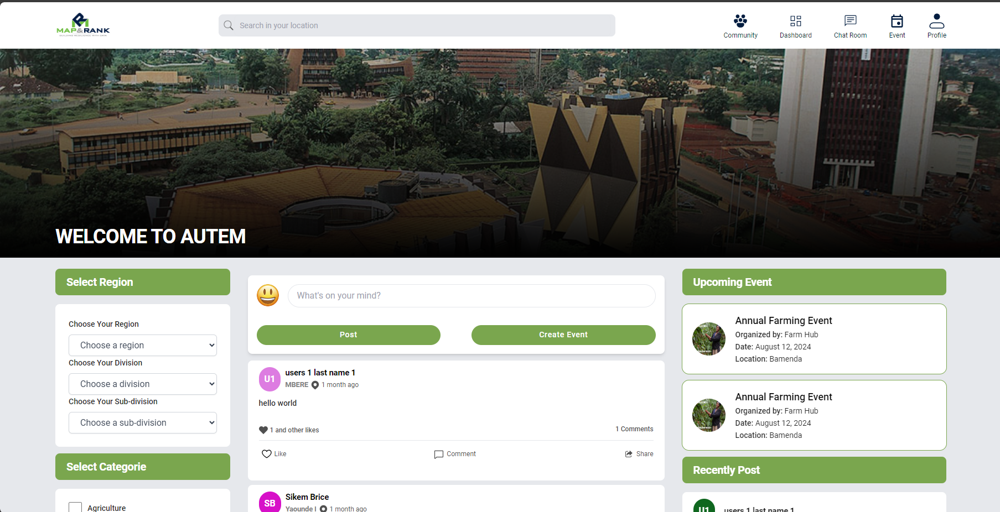

RESIDAT is a digital platform for sharing place-based information on climate risks from spatial data and citizen science reports .This platform shall have five main components 
- Visualization of place-based climate risks
- information through dashboards 
- Hosting of published reports by community stakeholders 
- Chatroom for community climate realities
- Sending out mobile notifications by local and regional climate authoritative bodies.

 </img>

## Table of Contents 📚
1. [Introduction](#introduction-🌟)
2. [Context](#context-💡-)
3. [Features](#features-✨)
4. [Test](#test-🧪)
5. [Code of Conduct](#code-of-conduct-)
6. [FAQs](#faqs-)
7. [License](#license-)
8. [Acknowledgments](#acknowledgments-)
9. [Change Log](#change-log-)

## Introduction 🌟

 <a href="https://dev.residat.com/community">RESIDAT</a> is a digital platform designed to enhance community resilience by providing access to climate risk information in Cameroon. It leverages spatial data and citizen science reports to visualize climate risks through interactive GIS dashboards. The platform offers a suite of features including:

- Visualization Dashboards: Interactive maps and graphs for understanding local climate risks and stakeholder activities.
- Community Intelligence: A repository for stakeholders to publish, manage, and interact with climate adaptation reports.
- Community Chat Rooms: Spaces for real-time discussion and exchange of climate-related information and services..

 <a href="https://dev.residat.com/community">RESIDAT</a> serves as a critical tool for local and regional climate authoritative bodies to send out mobile notifications and engage communities in proactive climate risk management.

## Context 💡

 <a href="https://dev.residat.com/community">RESIDAT</a> was born from the necessity to mitigate climate risks for communities in Cameroon. It targets the heart of climate vulnerability by providing critical, actionable data through GIS visualizations and real-time reports. The platform's goal is to empower communities and authorities to make informed decisions, enabling proactive and collaborative efforts towards climate resilience. In the face of increasing climate challenges,  <a href="https://dev.residat.com/community">RESIDAT</a> stands as a beacon of innovation and solidarity.

### Vision Statement
"Residat envisions a resilient Cameroon where every community has the knowledge and tools to adapt to climate variability. Our vision is to become a leading platform in climate risk assessment and adaptation strategies, contributing to sustainable development and disaster risk reduction through innovative geospatial technologies."

### Mission Statement
"Our mission is to empower vulnerable communities in Cameroon by providing them with accurate, accessible, and actionable geospatial data on climate hazards. Through the integration of GIS, drone technology, and big data analytics, Residat aims to facilitate informed decision-making and proactive environmental management."

### Community Statement
"Residat is dedicated to fostering a collaborative environment where scientists, local authorities, developers, and community members come together to combat climate risks. We encourage the sharing of insights, the development of local solutions, and the creation of a united front against the adverse effects of climate change."

### Licensing Strategy
"To maximize impact and encourage innovation, Residat will operate under an AGPL License, promoting open-source collaboration. This approach will allow for the free use, modification, and distribution of our resources, ensuring they remain accessible for adaptation to other regions facing similar climate challenges."

## Features ✨

 <a href="https://dev.residat.com/community">RESIDAT</a> offers a powerful suite of features designed to provide stakeholders with comprehensive climate risk data and facilitate community engagement in climate resilience:

- Interactive GIS Dashboards: Leveraging cutting-edge GIS technology,  <a href="https://dev.residat.com/community">RESIDAT</a> provides dynamic maps and graphs that allow users to visualize and interact with climate risk data specific to their local communities.

- Community Intelligence Reports: A dedicated space for stakeholders to publish, manage, and interact with reports on climate adaptation efforts. These reports provide valuable insights into local initiatives and challenges.

- Real-Time Community Chat Rooms: These forums offer a space for stakeholders to discuss climate realities, share observations, and promote climate services, fostering a community-driven approach to climate resilience.

- Mobile Notifications: Integration with mobile platforms ensures that stakeholders receive timely updates and warnings about climate hazards, enabling swift and informed responses to emerging risks.

- Citizen Science Contributions: Encouraging local community members to contribute data and reports,  <a href="https://dev.residat.com/community">RESIDAT</a> amplifies the reach and accuracy of climate risk information through citizen science.

- Data-Driven Insights: By analyzing spatial data and user-contributed reports,  <a href="https://dev.residat.com/community">RESIDAT</a> provides actionable insights that support climate risk management and decision-making processes.

- Stakeholder Engagement Tools: Features designed to enhance collaboration among various actors, including local authorities, NGOs, businesses, and academia, to drive collective action in climate adaptation.

## Testing 🧪

Testing is a crucial aspect of the development process, ensuring that the code is robust and behaves as expected. In the Residat project, we employ Vitest for our testing framework, providing an efficient and feature-rich environment for both unit and integration testing. Below is a summary of the current test coverage and details about the testing setup and examples.

### Test Coverage Summary

<!-- </img> -->

The test coverage report provides valuable insight into the robustness of our test suite. Here's a brief overview:

- **Overall Coverage**: Approximately 58.67% of statements and 69.58% of branches are covered by tests.
- **Components**: Some components like `EventAlertBox` and `IconWithLabel` have 100% statement coverage, which is excellent. However, other areas like the `src/assets` and `src/plugins` have 0% coverage, indicating potential areas for improvement.
- **Features**: The `SocialProfile` feature has substantial testing with over 96% coverage in some parts, but the `Report` feature has no tests yet.
- **Services and Stores**: The services have about 33% coverage, while the stores are at 26.31%, suggesting that state management testing could be enhanced.

## Code of Conduct 📜

### RESIDAT Contributor Code of Conduct

As contributors and maintainers of the RESIDAT project, we pledge to foster an open and welcoming environment for everyone. We are committed to making participation in our project and our community a harassment-free experience for everyone, regardless of age, body size, disability, ethnicity, sex characteristics, gender identity and expression, level of experience, education, socio-economic status, nationality, personal appearance, race, religion, or sexual identity and orientation.

#### Our Principles
- **Collaborative Ethos**: We create an inclusive space for diverse backgrounds and experiences, fostering a unique vision and product that resonates with the RESIDAT platform users.
  
- **Harmony through Dialogue**: We promote progress through open discussions, encouraging all community members to share ideas and engage respectfully to achieve consensus and resolve issues.
  
- **Team Spirit**: Recognizing that we each represent a piece of the RESIDAT puzzle, we value your skills and ask that you respect and value the contributions of others.

#### Our Pledge
We accommodate and uphold diversity in all forms, ensuring that participation in our project and community is a harassment-free experience for everyone.

#### Behavior Standards
Positive environment-contributing behaviors include:
- Kind and considerate communication.
- Respect and acknowledgment of our diverse audience and community members.
- Refraining from insults, bigotry, and offensive language.
- Exercising empathy and understanding towards others.

Unacceptable behaviors include:
- Any form of harassment, either public or private.
- Abusive comments, trolling, and offensive rhetoric.
- Religious, political, and cultural attacks.
- Posting or sharing inappropriate content.
- Disclosing private information without consent.
- Any other behaviors considered inappropriate in a professional setting.

#### Our Responsibilities
The RESIDAT designated team is responsible for enforcing community standards and may take appropriate action against unacceptable behavior.

#### Scope
This Code of Conduct applies both within project spaces and public spaces when individuals represent the project or community.

#### Enforcement
Instances of unacceptable behavior can be reported to the designated team at support@mapnrank.com with a detailed description and any relevant evidence. All complaints will be reviewed, investigated, and result in a response deemed necessary and appropriate to the circumstances.

#### Violations
Violations of this Code of Conduct may result in expulsion from the community or other repercussions as deemed appropriate by the project maintainers.

By contributing to RESIDAT, you agree to abide by these principles and behaviors to ensure our community remains welcoming, inspiring, and constructive for all.

## FAQs ❓

// Answers to frequently asked questions.

## License ⚖️

// Open-source license information.

## Acknowledgments 🙏

// Credits to contributors and special mentions.

## Change Log 📝

// Log of changes and version history.

---

